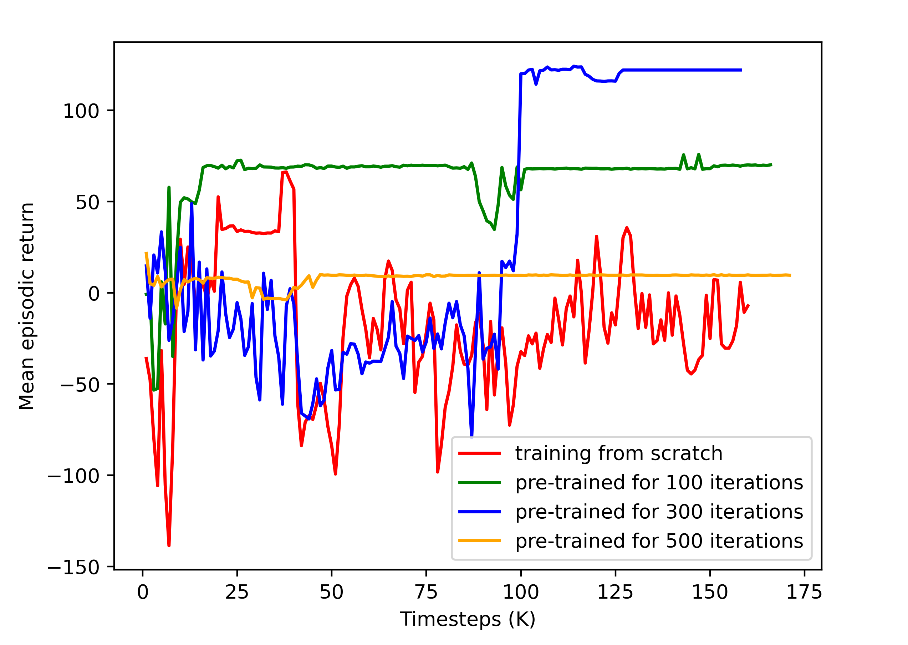

# DeepPlace

### Implementation of NeurIPS 2021 paper "On Joint Learning for Solving Placement and Routing in Chip Design"
An end-to-end learning approach DeepPlace for placement problem with two stages. The deep reinforcement learning (DRL) agent places the macros sequentially, followed by a gradient-based optimization placer to arrange millions of standard cells. We use [PPO](https://github.com/ikostrikov/pytorch-a2c-ppo-acktr-gail) for all the experiments implemented with Pytorch, and the GPU version of
[DREAMPlace](https://github.com/limbo018/DREAMPlace) is adopted as gradient based optimization placer for arranging standard cells.

## Requirements

* [PyTorch](http://pytorch.org/)
* [OpenAI baselines](https://github.com/openai/baselines)
* [DREAMPlace](https://github.com/limbo018/DREAMPlace)

In order to install requirements, follow:

```bash
# PyTorch
conda install pytorch torchvision -c soumith

# Baselines for Atari preprocessing
git clone https://github.com/openai/baselines.git
cd baselines
pip install -e .

# Other requirements
pip install -r requirements.txt

# DREAMplace installation
git clone --recursive https://github.com/limbo018/DREAMPlace.git
mkdir build 
cd build 
cmake .. -DCMAKE_INSTALL_PREFIX=your_install_path -DPYTHON_EXECUTABLE=$(which python)
make 
make install

#Get benchmarks
python benchmarks/ispd2005_2015.py

# DGL installation
conda install -c dglteam dgl-cuda10.2
```

## Training

### Macro Placement

```bash
python main.py --task "place" --algo ppo --use-gae --lr 2.5e-4 --clip-param 0.1 --value-loss-coef 0.5 --num-processes 1 --num-steps 2840 --num-mini-batch 4 --log-interval 1 --use-linear-lr-decay --entropy-coef 0.01
```

### Joint Macro/Standard cell Placement

```bash
python DeepPlace/main.py --task "fullplace" --algo ppo --use-gae --lr 2.5e-4 --clip-param 0.1 --value-loss-coef 0.5 --num-processes 1 --num-steps 2840 --num-mini-batch 4 --log-interval 1 --use-linear-lr-decay --entropy-coef 0.01
```

### Validation

```bash
python validation.py --task "place" --num-processes 1 --num-mini-batch 1 --num-steps 710 --lr 2.5e-4 --clip-param 0.1 --value-loss-coef 0.5 --entropy-coef 0.01
```

## Results




## Citations

If you find our paper/code useful in your research, please citing
```
@article{cheng2021joint,
  title={On Joint Learning for Solving Placement and Routing in Chip Design},
  author={Cheng, Ruoyu and Yan, Junchi},
  journal={Advances in Neural Information Processing Systems},
  volume={34},
  pages={16508--16519},
  year={2021}
}
```
