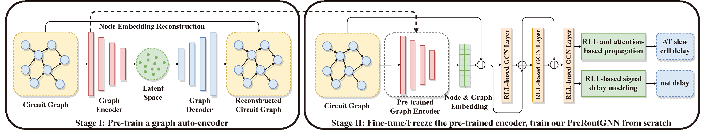

# PreRoutGNN
- This is the implementation of the AAAI 2024 paper "PreRoutGNN for Timing Prediction with Order Preserving Partition: Global Circuit Pre-training, Local Delay Learning and Attentional Cell Modeling"


## Install
- We run experiments on 
  - Ubuntu 20.04
  - Python 3.8.13
  - PyTorch 1.12.1
  - DGL 0.9.1
  - CUDA 11.3
```bash
conda create -n PreRoutGNN python=3.8
conda activate PreRoutGNN
conda install pytorch==1.12.1 cudatoolkit=11.3 -c pytorch
pip install dgl_cu113==0.9.1 -f https://data.dgl.ai/wheels/repo.html
pip install -r requirements.txt
```

## Data
- Please download data from [TimingGCN](https://github.com/TimingPredict/TimingPredict) and make data with following file structure:
```
data
└── 8_rat
    ├── aes128.graph.bin
    ├── aes192.graph.bin
    ├── aes256.graph.bin
    ├── aes_cipher.graph.bin
    ├── blabla.graph.bin
    ├── BM64.graph.bin
    ├── cic_decimator.graph.bin
    ├── des.graph.bin
    ├── genericfir.graph.bin
    ├── jpeg_encoder.graph.bin
    ├── picorv32a.graph.bin
    ├── salsa20.graph.bin
    ├── spm.graph.bin
    ├── synth_ram.graph.bin
    ├── usb_cdc_core.graph.bin
    ├── usbf_device.graph.bin
    ├── usb.graph.bin
    ├── wbqspiflash.graph.bin
    ├── xtea.graph.bin
    ├── y_huff.graph.bin
    └── zipdiv.graph.bin

1 directory, 21 files
```
- Circuit graphs for training and testing are shown in `circuits_json/circuits-original.json` and `circuits_split_json/data_split-original.json`

## Test
- We provide checkpoints for graph encoder and PreRoutGNN in `checkpoint/PreRoutGNN.pt`
```bash
bash test.sh
```

## Train
### Train graph encoder
- For more arguments, please run `python main_graph_autoencoder.py --help`
```bash
bash train_encoder.sh
```
### Train PreRoutGNN
- Note that please add path to the pre-trained graph encoder checkpoint in `--graph_autoencoder_checkpoint`
- For more arguments, please run `python main.py --help`
```bash
bash train_PreRoutGNN.sh
```

## Citation
- If you find this work useful, please cite our paper:
```
@inproceedings{zhong2024preroutgnn,
  title={PreRoutGNN for Timing Prediction with Order Preserving Partition: Global Circuit Pre-training, Local Delay Learning and Attentional Cell Modeling},
  author={Zhong, Ruizhe and Ye, Junjie and Tang, Zhentao and Kai, Shixiong and Yuan, Mingxuan and Hao, Jianye and Yan, Junchi},
  booktitle={AAAI},
  year={2024}
}
```

## Acknowledgement
- We thank the open-source implementation of [TimingGCN](https://github.com/TimingPredict/TimingPredict)